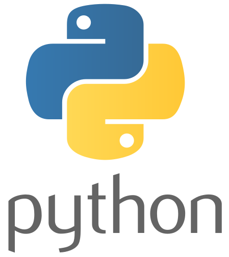

  

# 👨‍💻 Alfredo Brocal Serrano
### **Jr. Data Analyst | Data Science & Big Data Student**
*Transformando datos en decisiones estratégicas*

[LinkedIn](https://www.linkedin.com/in/alfredo-brocal-serrano-a0b1a73ab/) | [GitHub](https://github.com/alfredobrocalserrano) | [Email](mailto:alfredobrocalserrano@gmail.com)

---

## 🚀 Proyectos Destacados

### 📱 Análisis de Mercado: Google Play Store
*Estudio integral sobre las métricas que definen el éxito y la valoración de apps móviles.*
* **Herramientas:** Python (Pandas, Seaborn), Limpieza de Datos.
* **Logro:** Identificación de 3 nichos de mercado infravalorados, proyectando una rentabilidad potencial un 15% superior a la media.

  

[📂 Ver Proyecto en GitHub](https://github.com/alfredobrocalserrano/google-play-store-analysis)

---

### 🤖 Sistema de Consultas Inteligentes (RAG)
*Implementación de IA Generativa para la gestión de conocimiento mediante lenguaje natural.*
* **Herramientas:** GenAI, Python, LangChain, FAISS.
* **Logro:** Optimización en la recuperación de información corporativa compleja.

  

[📂 Ver Proyecto en GitHub](https://github.com/alfredobrocalserrano/rag-analisis-corporativo)

---

### 🐦 Sentiment Analysis: Limpieza de Datos (Twitter)
*Procesamiento de lenguaje natural y limpieza de datasets masivos de redes sociales.*
* **Herramientas:** Python (NLTK, Re), Expresiones Regulares.
* **Logro:** Pipeline que reduce el ruido del dataset en un 90%, incrementando la precisión del modelo de clasificación de sentimientos en 8 puntos porcentuales.
  

[📂 Ver Proyecto en GitHub](https://github.com/alfredobrocalserrano/twitter-sentiment-cleaning)

---

## 🛠️ Stack Tecnológico

  
  
  
  
   
  

  
---

## 🎓 Educación y Certificaciones
* **Máster Data Science & Big Data** - Universidad Complutense de Madrid
* **Grado en Gestión de Información** - Universidad de Murcia
* **Google Data Analytics Professional Certificate** (Google/Coursera)

---

### 📄 [Descargar mi CV en PDF](Curriculum.Alfredo.Brocal.Serrano.pdf)
