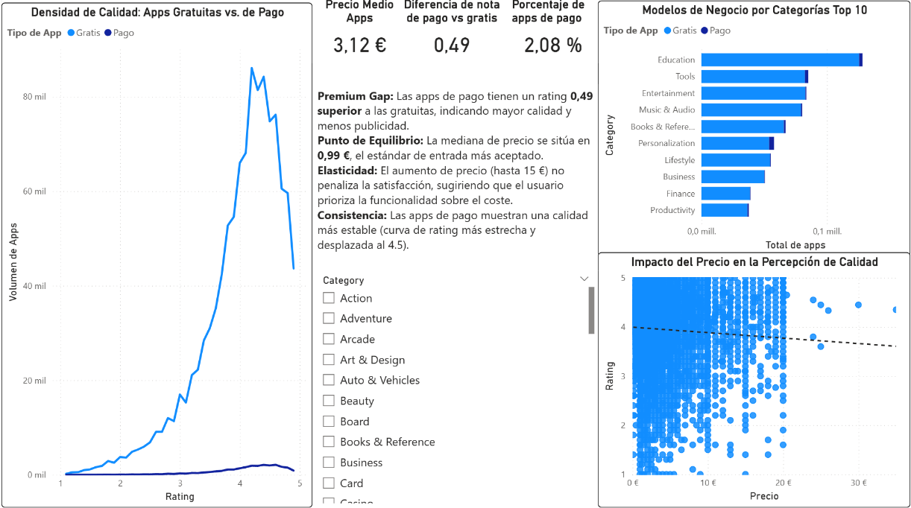
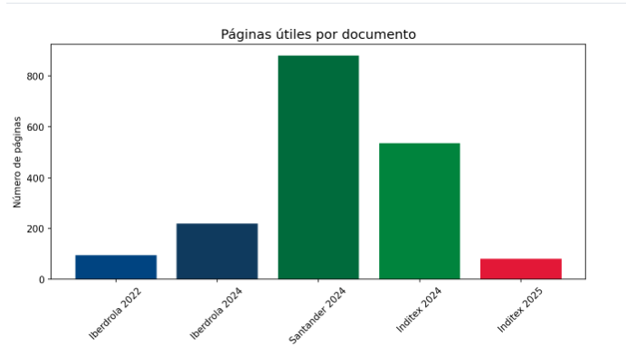
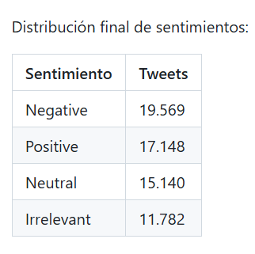

  

<h1 align="center">Alfredo Brocal Serrano</h1>

<b>Jr. Data Analyst | Generando valor con Python, SQL y Power BI</b>

  <a href="https://www.linkedin.com/in/alfredo-brocal-serrano-a0b1a73ab/">LinkedIn</a> | 
  <a href="https://github.com/alfredobrocalserrano">GitHub</a> | 
  <a href="mailto:alfredobrocalserrano@gmail.com">Email</a>

---

## 🛠️ Stack Tecnológico

  
  
  
  
  

---

## 🚀 Proyectos Destacados

  <h3>📱 Análisis de Mercado: Google Play Store</h3>
  
<i>Estudio integral sobre las métricas que definen el éxito de apps móviles.</i>

  
  
<b>Logro:</b> Identificación de nichos de mercado con alta rentabilidad.

  <a href="https://github.com/alfredobrocalserrano/google-play-store-analysis">Ver Proyecto en GitHub</a>

  <h3>🤖 Sistema de Consultas Inteligentes (RAG)</h3>
  
<i>IA Generativa para la gestión de conocimiento corporativo.</i>

  
  
<b>Logro:</b> Optimización en la recuperación de informes complejos.

  <a href="https://github.com/alfredobrocalserrano/rag-analisis-corporativo">Ver Proyecto en GitHub</a>

  <h3>🐦 Sentiment Analysis: Limpieza de Datos (Twitter)</h3>
  
<i>Procesamiento de lenguaje natural y limpieza de datasets masivos de redes sociales.</i>

  
  
<b>Logro:</b> Creación de un pipeline de limpieza con RegEx que reduce el ruido del dataset en un 90%, optimizando la precisión de modelos posteriores.

  <a href="https://github.com/alfredobrocalserrano/twitter-sentiment-cleaning" style="color: #159957; font-weight: bold; text-decoration: none;">📂 Ver Proyecto en GitHub</a>

  <a href="TU_LINK_PDF" style="background-color: #159957; color: white; padding: 15px 25px; border-radius: 5px; text-decoration: none; font-weight: bold;">📥 Descargar CV Completo</a>

cal.Serrano.pdf)
